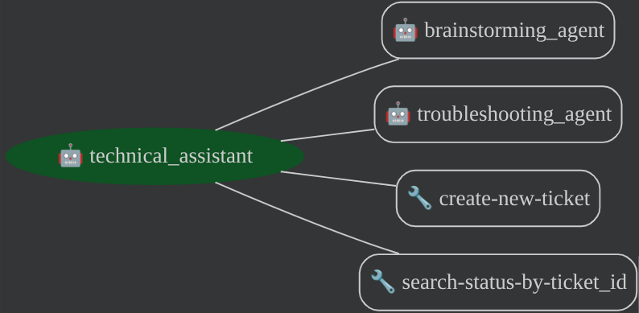

# Praxis-Multi-Agent AI Assistant for Brainstorming & Support.
## Overview 
The Tech Assistant is a sample agent designed to assist with the full lifecycle of technical work—from ideation to resolution. 
This sample agent uses ADK (Agent Development Kit), a PostgreSQL support case database, google search, MCP Toolbox, and deployed on Cloud Run.

It is designed to assist with:
1. Brainstorming & Strategy: Assisting with the ideation of new technology use cases and providing detailed implementation guidance.
2. Technical Troubleshooting: Helping triage and debug complex technical issues.
3. Support Ticket Management: Handling the creation and status tracking of support cases to ensure efficient resolution.


## Agent Flow



## Setup and Installation Guide

### Installation Steps

1. Clone the repository:

```bash
git clone https://github.com/SayantiDey/agnets-with-adk.git
cd tech_assistant
```

2. Edit the .env.example file to set up the environment variables and rename the file to .env

3. Authenticate the Google Cloud CLI, and enable Google Cloud APIs. 

```
gcloud auth login
gcloud auth application-default login 

export PROJECT_ID="<YOUR_PROJECT_ID>"
gcloud config set project $PROJECT_ID

gcloud services enable sqladmin.googleapis.com \
   compute.googleapis.com \
   cloudresourcemanager.googleapis.com \
   servicenetworking.googleapis.com \
   aiplatform.googleapis.com
```

4. Create a Cloud SQL for PostgreSQL instance. 

```bash
gcloud sql instances create supportcase-db \
--database-version=POSTGRES_15 \
--cpu=2 \
--memory=8GiB \
--region=us-central1 \
--edition=ENTERPRISE \
--root-password=<PUT_YOUR_PASSWORD>
```

Once created, you can view your instance in the Cloud Console.

5. Set up the `cases` table. 

- From the Cloud Console (Cloud SQL), open **Cloud SQL Studio**. 

- Log into the `supportcase-db` Database using the `postgres` user and the password you specified while creating the SQL instance.

- Open a new **Editor** tab. Then, paste in the following SQL code to set up the table and create vector embeddings.

```SQL
CREATE TABLE cases (
    ticket_id SERIAL PRIMARY KEY,             
    title VARCHAR(200) NOT NULL,              
    description TEXT,                         
    steps_taken VARCHAR(100),                    
    priority VARCHAR(20) DEFAULT 'p3-low',  
    error_msg VARCHAR(100), 
    status VARCHAR(50) DEFAULT 'Open',  
    contact VARCHAR(100) NOT NULL ,
    creation_time TIMESTAMP WITH TIME ZONE DEFAULT CURRENT_TIMESTAMP, 
);
```

- Add sample data to the table. 

From Cloud SQL Studio, paste in the following SQL code to load in sample data.

```SQL
INSERT INTO cases (title, description, error_msg, steps_taken, priority, status, contact)
VALUES
('GCE VM instance fails to start', 'The ''web-server-prod-01'' GCE instance in us-central1-a is not starting.', 'ZONE_RESOURCE_POOL_EXHAUSTED', 'Tried starting multiple times. Checked GCP status dashboard.', 'p1-high', 'Open', 'arjun.sh@example.net'),
('App Engine cannot connect to Cloud SQL', 'Our App Engine service ''user-api'' is failing to connect to the ''user-db'' Cloud SQL instance.', 'Connection timed out', 'Checked firewall rules and Cloud SQL proxy settings.', 'p1-high', 'In Progress', 'priya.k@abc.com'),
('IAM permission denied for Pub/Sub', 'Service account ''data-pipeline-sa'' is denied permission to publish to a Pub/Sub topic.', '7 PERMISSION_DENIED', 'Verified the service account has the ''Pub/Sub Publisher'' role.', 'p2-edium', 'Open', 'sneha.gupta@example.com'),
('Project has exceeded CPU quota', 'Cannot launch new GCE instances in project ''dev-sandbox-123'' in asia-south1.', 'QUOTA_EXCEEDED', 'Submitted a quota increase request via the console.', 'p3-Low', 'In Progress', 'vikram.s@example.ai'),
('GKE Autopilot not scaling up', 'GKE Autopilot cluster is not scaling pods for the ''payment-gateway'' deployment during peak load.', NULL, 'Checked HorizontalPodAutoscaler logs and resource limits.', 'p2-medium', 'Open', 'a.smith@sample.org');
```

- Verify that the database is ready.

From Cloud SQL studio, run:

```SQL
SELECT * FROM tickets;
```


6. Run the MCP Toolbox for Databases Server Locally to verify

- First, update `mcp-toolbox/tools.yaml` for your Cloud SQL instance: 

```yaml
sources:
 my-cloud-sql-source:
   kind: cloud-sql-postgres
   project: ${GCP_PROJECT_ID}
   region: us-central1
   instance: supportcase-db
   database: postgres
   user: ${DB_USER}
   password: ${DB_PASSWORD}
```
- Run the following command (from the mcp-toolbox folder) to start the server:
```bash
./toolbox --tools-file "tools.yaml"
```
Ideally you should see an output that the Server has been able to connect to our data sources and has loaded the toolset and tools. A sample output:
./toolbox --tools-file "tools.yaml"
2025-04-23T14:32:29.564903079Z INFO "Initialized 1 sources." 
2025-04-23T14:32:29.565009291Z INFO "Initialized 0 authServices." 
2025-04-23T14:32:29.565070176Z INFO "Initialized 2 tools." 
2025-04-23T14:32:29.565120847Z INFO "Initialized 2 toolsets." 
2025-04-23T14:32:29.565510068Z INFO "Server ready to serve!" 

7. Run the Agent Locally to verify
- Once the MCP server has started successfully, in another terminal, launch the Agent (from the tech_assistant folder) with command shown below.
```bash
uv run adk web
```
8. Host MCP Toolbox server on Cloud Run
- Launch a new Cloud Shell Terminal or use an existing Cloud Shell Terminal. Go to the mcp-toolbox folder, in which the toolbox binary and tools.yaml are present.
- Set the PROJECT_ID variable to point to your Google Cloud Project Id.

```bash
export PROJECT_ID="YOUR_GOOGLE_CLOUD_PROJECT_ID" 
```
- verify that the following Google Cloud services are enabled in the project.
```bash 
gcloud services enable run.googleapis.com \
                       cloudbuild.googleapis.com \
                       artifactregistry.googleapis.com \
                       iam.googleapis.com \
                       secretmanager.googleapis.com
```
- create a separate service account that will be acting as the identity for the Toolbox service that we will be deploying on Google Cloud Run.
```bash
gcloud iam service-accounts create toolbox-identity

gcloud projects add-iam-policy-binding $PROJECT_ID \
   --member serviceAccount:toolbox-identity@$PROJECT_ID.iam.gserviceaccount.com \
   --role roles/secretmanager.secretAccessor

gcloud projects add-iam-policy-binding $PROJECT_ID \
   --member serviceAccount:toolbox-identity@$PROJECT_ID.iam.gserviceaccount.com \
   --role roles/cloudsql.client
```
- Upload the tools.yaml file as a secret and since we have to install the Toolbox in Cloud Run, we are going to use the latest Container image for the toolbox and set that in the IMAGE variable.
```bash
gcloud secrets create tools --data-file=tools.yaml
export IMAGE=us-central1-docker.pkg.dev/database-toolbox/toolbox/toolbox:latest 
```
- Deploy to cloud Run
```bash
gcloud run deploy toolbox \
--image $IMAGE \
--service-account toolbox-identity \
--region us-central1 \
--set-secrets "/app/tools.yaml=tools:latest" \
--args="--tools_file=/app/tools.yaml","--address=0.0.0.0","--port=8080" \
--allow-unauthenticated
```
You can now visit the Service URL listed in the output in the browser. It should display the "Hello World" message.

9. Deploy the Agent on Cloud Run
- Go to tech_assistant/tech-assistant/agent.py and point to the Toolbox service URL that is running on Cloud Run
```bash
toolbox = ToolboxTool("CLOUD_RUN_SERVICE_URL")
```
- Navigate to the tech_assistant folder and let's set the following environment variables first:

```bash
export GOOGLE_CLOUD_PROJECT=YOUR_GOOGLE_CLOUD_PROJECT_ID
export GOOGLE_CLOUD_LOCATION=us-central1
export AGENT_PATH="hotel-agent-app/"
export SERVICE_NAME="hotels-service"
export APP_NAME="hotels-app"
export GOOGLE_GENAI_USE_VERTEXAI=True
```

Now we can deploy Toolbox to Cloud Run. We'll use the latest [release version](https://github.com/googleapis/genai-toolbox/releases) of the MCP Toolbox image (we don't need to build or deploy the `toolbox` from source.)

```bash
gcloud run deploy toolbox \
    --image us-central1-docker.pkg.dev/database-toolbox/toolbox/toolbox:latest \
    --service-account toolbox-identity \
    --region us-central1 \
    --set-secrets "/app/tools.yaml=tools:latest" \
    --set-env-vars="PROJECT_ID=$PROJECT_ID,DB_USER=postgres,DB_PASS=admin" \
    --args="--tools-file=/app/tools.yaml","--address=0.0.0.0","--port=8080" \
    --allow-unauthenticated
```

Verify that the Toolbox is running by getting the Cloud Run logs: 

```bash 
gcloud run services logs read toolbox --region us-central1
```

You should see: 

```bash
2025-05-15 18:03:55 2025-05-15T18:03:55.465847801Z INFO "Initialized 1 sources."
2025-05-15 18:03:55 2025-05-15T18:03:55.466152914Z INFO "Initialized 0 authServices."
2025-05-15 18:03:55 2025-05-15T18:03:55.466374245Z INFO "Initialized 9 tools."
2025-05-15 18:03:55 2025-05-15T18:03:55.466477938Z INFO "Initialized 2 toolsets."
2025-05-15 18:03:55 2025-05-15T18:03:55.467492303Z INFO "Server ready to serve!"
```

Save the Cloud Run URL for the Toolbox service as an environment variable.

```bash
export MCP_TOOLBOX_URL=$(gcloud run services describe toolbox --region us-central1 --format "value(status.url)")
```

Now we are ready to deploy the ADK Python agent to Cloud Run! :rocket:

### 10 - Create an Artifact Registry repository.

This is where we'll store the agent container image.

```bash
gcloud artifacts repositories create adk-samples \
  --repository-format=docker \
  --location=us-central1 \
  --description="Repository for ADK Python sample agents" \
  --project=$PROJECT_ID
```

### 11 - Containerize the ADK Python agent. 

Build the container image and push it to Artifact Registry with Cloud Build.

```bash
gcloud builds submit --region=us-central1 --tag us-central1-docker.pkg.dev/$PROJECT_ID/adk-samples/software-bug-assistant:latest
```

### 12 - Deploy the agent to Cloud Run 


> [!NOTE]    
> 
> If you are using Vertex AI instead of AI Studio for Gemini calls, you will need to replace `GOOGLE_API_KEY` with `GOOGLE_CLOUD_PROJECT`, `GOOGLE_CLOUD_LOCATION`, and `GOOGLE_GENAI_USE_VERTEXAI=TRUE` in the last line of the below `gcloud run deploy` command.
> 
> ```bash
> --set-env-vars=GOOGLE_CLOUD_PROJECT=$PROJECT_ID,GOOGLE_CLOUD_LOCATION=us-central1,GOOGLE_GENAI_USE_VERTEXAI=TRUE,MCP_TOOLBOX_URL=$MCP_TOOLBOX_URL,GITHUB_PERSONAL_ACCESS_TOKEN=$GITHUB_PERSONAL_ACCESS_TOKEN
> ```

```bash
gcloud run deploy software-bug-assistant \
  --image=us-central1-docker.pkg.dev/$PROJECT_ID/adk-samples/software-bug-assistant:latest \
  --region=us-central1 \
  --allow-unauthenticated \
  --set-env-vars=GOOGLE_API_KEY=$GOOGLE_API_KEY,MCP_TOOLBOX_URL=$MCP_TOOLBOX_URL,GITHUB_PERSONAL_ACCESS_TOKEN=$GITHUB_PERSONAL_ACCESS_TOKEN 
```

When this runs successfully, you should see: 

```bash
Service [software-bug-assistant] revision [software-bug-assistant-00001-d4s] has been deployed and is serving 100 percent of traffic.
```


### 13 - Test the Cloud Run Agent

Open the Cloud Run Service URL outputted by the previous step. 

You should see the ADK Web UI for the Software Bug Assistant. 

Test the agent by asking questions like: 
- `Any issues around database timeouts?` 
- `How many bugs are assigned to samuel.green@example.com? Show a table.` 
- `What are some possible root-causes for the unresponsive login page issue?` (Invoke Google Search tool)
- `Get the bug ID for the unresponsive login page issues` --> `Boost that bug's priority to P0.`. 
- `Create a new bug.` (let the agent guide you through bug creation)

*Example workflow*: 


### Clean up 

You can clean up this agent sample by: 
- Deleting the [Artifact Registry](https://console.cloud.google.com/artifacts). 
- Deleting the two [Cloud Run Services](https://console.cloud.google.com/run). 
- Deleting the [Cloud SQL instance](https://console.cloud.google.com/sql/instances). 
- Deleting the [Secret Manager secret](https://console.cloud.google.com/security/secret-manager). 
